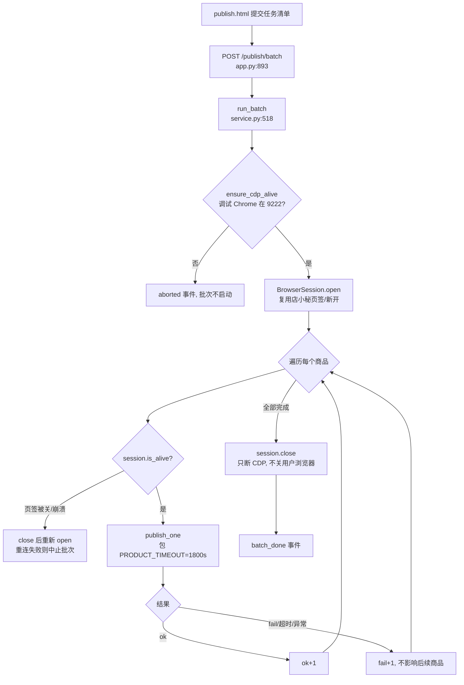
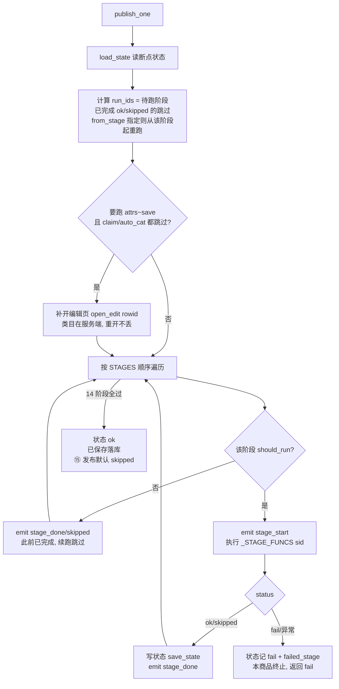
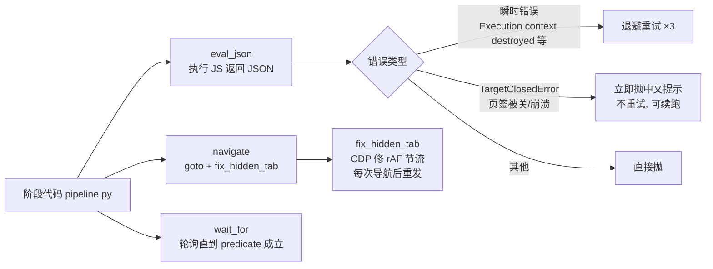

# 发布工作流代码逻辑汇总

> 基于 `app/publish/` 与 `app.py` 的实际实现整理（2026-08-21）。
> 入口：`POST /publish/batch`（app.py:893）→ `run_batch()`（app/publish/service.py:518）→ 逐商品 `publish_one()`。
> 进度通过 `on_progress` 结构化事件走 SSE 推到 `publish.html`。

## 1. 整体入口与批次编排

## 2. 单商品状态机（断点续跑）

`publish_one`（service.py:441）按 `workspace/publish-state/<offerId>.json` 决定跳过/重跑：

## 3. 15 个阶段的内部逻辑

```mermaid
flowchart TD
    S1["① extract 采集提炼<br/>extract.extract_product: 打开1688链接<br/>解析标题/属性/主图/详情图<br/>+ enrich_vision 视觉回填<br/>产出 product-info.json"]
    S2["② claim 采集认领<br/>无 rowid: collect_and_claim 去<br/>productCrawl/dataAcquisition 认领 → 拿 rowid<br/>有 rowid: 跳过认领<br/>最后 open_edit 打开编辑页"]
    S3["③ auto_cat 产品类目<br/>缓存快路径: 已知路径清单交 LLM 选一条<br/>→ 逐列直点(不前瞻) → 确认 → 回读<br/>未命中/点不中/回读不符 → 落回逐级走树<br/>每级: 读列 → 前瞻子类目 → LLM 选 → 点击"]
    S4["④ attrs 属性审核<br/>dump_attrs: 只读必填项, options 优先取缓存<br/>缓存缺的行才点开下拉滚虚拟列表读<br/>→ LLM 比对源信息出修改清单<br/>→ apply 逐行写入 + 回读校验<br/>缓存行写入失败 → 单行重读+回灌+重选<br/>主面料成分按源值确定性覆盖, 不用 LLM 数<br/>源没写含量按该纤维100%, 全没写按聚酯纤维100%"]
    S5["⑤ titles 标题产地<br/>set_titles: LLM 生成英文标题等"]
    S6["⑥ material 素材图<br/>vision.pick_material 选图<br/>→ images.square_image 裁方<br/>→ set_material 替换"]
    S7["⑦ skc SKC颜色图<br/>vision.plan_skc 按颜色行分图<br/>→ 重命名 main-XX.jpg + batch_fit34<br/>→ skc_replace_row 逐行换图"]
    S8["⑧ fix_sizes 尺码勾选<br/>fix_sizes: 按源尺码勾选<br/>回读 SKU 表行数"]
    S9["⑨ sizechart 尺码表<br/>add_sizechart: 选模板填参数<br/>已存在则跳过"]
    S10["⑩ variant 变种信息<br/>set_variant: 填行 + 申报价(默认188.88, UI可覆盖)<br/>服装尺寸固定30x25x3, 其它类目交LLM按实际体积估<br/>回读校验不过 → manual_check 继续"]
    S11["⑪ stock 库存SKU<br/>set_stock: 选仓库逐行填库存<br/>回读校验不过 → manual_check 继续"]
    S12["⑫ shipping 运输信息<br/>set_shipping: 选最长时效 + 运费模板"]
    S13["⑬ desc 描述长图<br/>desc_map 读模块 → vision.plan_desc<br/>→ desc_delete 删违规模块<br/>→ 下载/edit_image 英化/vision 质检<br/>→ desc_replace 替换 → desc_save<br/>单张失败保留原图, 不拖垮阶段"]
    S14["⑭ save 保存落库<br/>save: 点保存 + 服务端校验<br/>红色区块未过 → manual_check, 记 fail 可续跑<br/>只落库, 绝不碰发布按钮"]
    S15["⑮ publish 立即发布 (默认 skipped)<br/>需 do_publish=True 且 ⑭ save 成功<br/>publish_now: hover 展开发布下拉<br/>等入场动画 (判据看项的 rect 高度)<br/>→ 点「立即发布」(同一段 JS 内完成)<br/>→ 去草稿箱/在线产品列表取证<br/>不可逆, confirm=True 才执行"]
    S1 --> S2 --> S3 --> S4 --> S5 --> S6 --> S7 --> S8 --> S9 --> S10 --> S11 --> S12 --> S13 --> S14 --> S15
```

## 4. 浏览器原语层（browser.py）

所有页面操作走 `BrowserSession`（Playwright over CDP 接管已登录 Chrome）：

## 类目/属性缓存（阶段③④加速）

`workspace/publish-cache/` 持久化两类【由类目决定、与商品无关】的客观事实，
把阶段③④里「重复发现已知信息」的开销省掉（实测 2026-08-22）：

| | 缓存内容 | 未命中 | 命中 |
| --- | --- | --- | --- |
| ③ 类目 | `categories.json` 用过的完整路径清单 | 110.1s（5 级 = 5 次 LLM + 逐级前瞻） | 26.3s（1 次 LLM + 5 列直点 7.6s） |
| ④ 属性 | `attrs/<site>-<leaf>-<hash>.json` 每行 label/required/options | 逐行点开下拉滚虚拟列表 | 省掉逐行读选项 |

设计要点：

- **只缓存客观事实，不缓存判断**。属性值取决于具体商品，每商品仍调一次 LLM 做匹配；
  缓存也**不存 current**（页面上的 current 带着前一批已填的值，会污染下个商品的判断）。
- **失效 = 写入即校验，不设过期**。`set_attr` 本就逐项回读校验，`status="error"` 就是
  缓存过期的信号；此时只重读那一行、回灌缓存、单独再问一次 LLM，其余行不受影响。
  故缓存失效的后果只是**变慢**而不是**变错**——这也是整层敢全程 best-effort 的前提。
- **slug 带路径哈希 + site**。「其他（...）」这类叶子名跨分支重复，只按叶子名分文件会把
  两套 options 混进一份，`_validate_attr_changes` 的 options 闸会因此放过不存在的选项。
- **截断的 options 拒收**。虚拟列表没滚到底时读到的是首屏 10 条，缓存了它会让
  `_rebuild_main_comp` 的纤维匹配静默失效，比不缓存更糟。
- **缓存永不造行、永不覆盖 required**：行集与必填标记只由活 DOM 决定。
- 管理入口：发布页缓存面板（含「本次启用」开关）、`GET/DELETE /publish/cache`、
  `publish_inspect.py cache-list / cache-clear`（只读本地 JSON，不占 CDP 会话）。

**最脆弱处**：快路径跳过了前瞻，而前瞻正是为「只看本级名字会选错分支」加的。若 LLM 从
清单里选了条「像但不对」的兄弟路径，直点会**成功**、下游全部校验都通过，错误一路带到
人工看列表才可能发现。缓解：提示词把代价不对称明确讲给模型（宁可答不匹配）、只在回读
真见到叶子名时才写缓存、`stage_done` 的 note 里标明走的是 `[缓存]` 还是 `[遍历]`。
新品类首次跑建议关掉「本次启用」，让遍历把路径种进缓存。

## 关键设计点

- **状态即断点**：每阶段结束立刻 `save_state`，任何中断（页签被关、超时、异常）后点「续跑」从 `failed_stage` 继续；`from_stage` 可强制从任意阶段重跑。
- **单页长会话**：claim 打开编辑页后到 save 全程不刷新页面，阶段间靠页面上的表单状态传递；续跑例外——由 `publish_one` 补开编辑页（类目等已落服务端的字段不丢）。
- **错误隔离**：单商品失败/超时只记 fail，批次继续；CDP 整个连不上才中止批次；页签被关会自动重连后继续后续商品。
- **人工兜底**：`manual_check` 事件（视觉没把握、回读校验不过、保存校验红色区块）推给 UI 提示，但尽量不阻断流程。
- **安全边界**：默认止于「保存落库」；⑮「立即发布」需显式开启（CLI `--publish`、
  `publish_now(confirm=True)`），且发布意愿不写进状态文件，续跑不会重复发布。

## 文件索引

| 文件 | 职责 |
| --- | --- |
| `app/publish/service.py` | 批次/单商品编排、15 阶段调度、断点状态、事件发射 |
| `app/publish/browser.py` | CDP 会话、6 个浏览器原语、瞬时/致命错误分类、fix_hidden_tab |
| `app/publish/pipeline.py` | 编辑页各阶段实现（类目/属性/标题/尺码/变种/库存/运输/描述/保存） |
| `app/publish/claim.py` | 采集认领（dataAcquisition → rowid） |
| `app/publish/extract.py` | 1688 源商品提取 + 视觉回填，产出 product-info.json |
| `app/publish/vision.py` | LLM/视觉决策（素材图、SKC 分图、描述英化计划、质检） |
| `app/publish/images.py` | 图片处理（裁方、3:4、英化编辑） |
| `app/publish/upload.py` | 图片直传店小秘图床 |
| `app/publish/cache.py` | 类目路径/属性选项磁盘缓存（阶段③④加速，best-effort） |
| `workspace/publish-state/*.json` | 每商品断点状态（stages 状态、rowid、info_path、failed_stage、cat_path） |
| `workspace/publish-cache/` | 类目路径清单 + 按类目分文件的属性选项缓存 |
