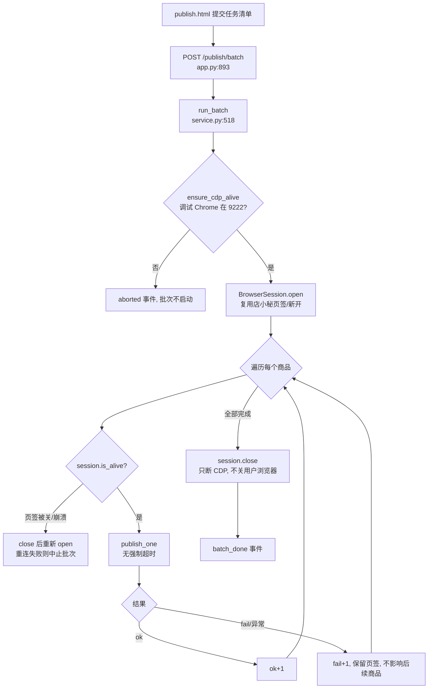
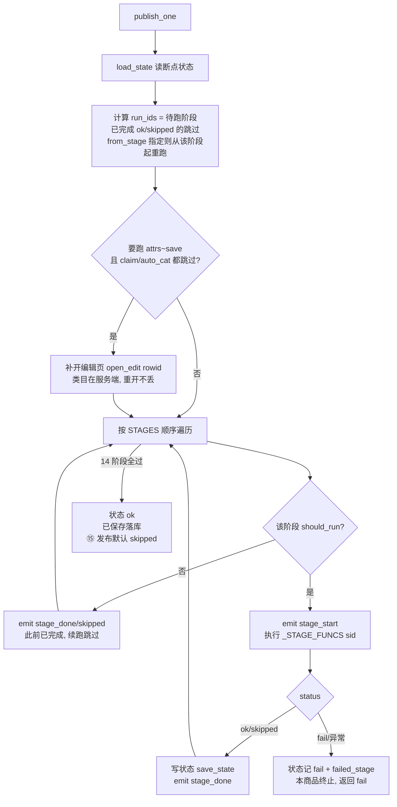
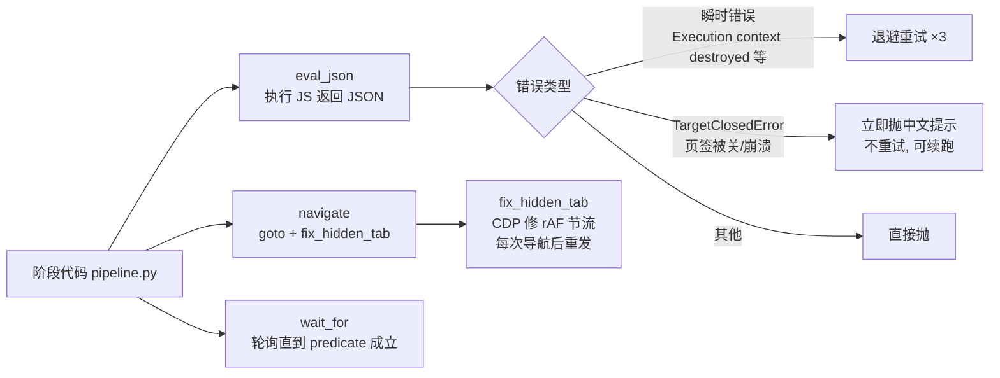

# 发布工作流代码逻辑汇总

> 基于 `app/publish/` 与 `app.py` 的实际实现整理（2026-08-21）。
> 入口：`POST /publish/batch`（app.py:893）→ `run_batch()`（app/publish/service.py:518）→ 逐商品 `publish_one()`。
> 进度通过 `on_progress` 结构化事件走 SSE 推到 `publish.html`。

## 1. 整体入口与批次编排

**中断告警（飞书）**：`run_batch` 里把 `on_progress` 过一层 `_alert_hook`
（service.py），在事件流上认三类中断并推飞书群机器人：`aborted`（批次中止）、
`product_done` 且 status=fail（单商品失败）、`batch_done` 且 fail>0（收尾汇总，
全绿不发）。挂在事件流上而不是逐处插调用——中断出口有十来个，逐处加容易漏，而
这三类本来就都有事件。`manual_check` 刻意不报：数量多、大多不阻断流程，报出来会把
告警群刷成日志流。发送全程 best-effort（没配 webhook 静默跳过、失败只 warning），
绝不因一条群消息发不出去中断批次。`run_batch` 本身抛出的异常在两个调用方
（app.py 的 `_run`、publish_run.py）各补一处 `alert_batch_crash`——钩子在
`run_batch` 内部，它自己炸了就报不了。

配置在 `config/config.toml` 的 `[publish.alert]`（`enabled` + `webhook`，凭证不进
版本库），或环境变量 `PUBLISH_ALERT_WEBHOOK`；自检 `python publish_run.py --test-alert`。

## 2. 单商品状态机（断点续跑）

`publish_one`（service.py:441）按 `workspace/publish-state/<offerId>.json` 决定跳过/重跑：

## 3. 阶段的内部逻辑

```mermaid
flowchart TD
    S1["① extract 采集提炼<br/>extract.extract_product: 打开1688链接<br/>解析标题/属性/主图/详情图<br/>+ enrich_vision 视觉回填<br/>产出 product-info.json"]
    S2["② claim 采集认领<br/>无 rowid: collect_and_claim 去<br/>productCrawl/dataAcquisition 认领 → 拿 rowid<br/>有 rowid: 跳过认领<br/>最后 open_edit 打开编辑页"]
    S3["③ auto_cat 产品类目<br/>缓存快路径: 已知路径清单交 LLM 选一条<br/>→ 逐列直点(不前瞻) → 确认 → 回读<br/>未命中/点不中/回读不符 → 落回逐级走树<br/>每级: 读列 → 前瞻子类目 → LLM 选 → 点击"]
    S4["④ attrs 属性审核<br/>dump_attrs: 只读必填项, options 优先取缓存<br/>缓存缺的行才点开下拉滚虚拟列表读<br/>→ LLM 比对源信息出修改清单<br/>→ apply 逐行写入 + 回读校验<br/>缓存行写入失败 → 单行重读+回灌+重选<br/>主面料成分按源值确定性覆盖, 不用 LLM 数<br/>源没写含量按该纤维100%, 全没写按聚酯纤维100%"]
    S5["⑤ titles 标题产地<br/>set_titles: LLM 生成英文标题等"]
    S6["⑥ material 素材图<br/>vision.pick_material 选图<br/>→ images.square_image 裁方<br/>→ set_material 替换"]
    S7["⑦ skc SKC颜色图<br/>vision.plan_skc 按颜色行分图<br/>→ 重命名 main-XX.jpg + batch_fit34<br/>→ skc_replace_row 逐行换图"]
    S7b["⑦b sku_preview SKU预览图<br/>#skuDataInfo 变种信息表第一列, 每SKU一张<br/>与⑥⑦是三处不同的图位, 互相正交<br/>sku_preview_state 读每行尺寸<br/>→ 非1:1或短边&lt;800 的行: 下载现有图<br/>→ images.square_image 合规化<br/>→ sku_preview_replace_row 原位换回<br/>不重判颜色归属(认领带来的归属本就对)<br/>只补像素与比例, 零 LLM 调用"]
    S8["⑧ fix_sizes 尺码勾选<br/>fix_sizes: 按源尺码勾选<br/>回读 SKU 表行数"]
    S9["⑨ sizechart 尺码表<br/>add_sizechart: 选模板填参数<br/>已存在则跳过"]
    S10["⑩ variant 变种信息<br/>set_variant: 填行 + 申报价(默认188.88, UI可覆盖)<br/>服装尺寸固定30x25x3, 其它类目交LLM按实际体积估<br/>回读校验不过 → manual_check 继续"]
    S11["⑪ stock 库存SKU<br/>set_stock: 选仓库逐行填库存<br/>回读校验不过 → manual_check 继续"]
    S12["⑫ shipping 运输信息<br/>set_shipping: 选最长时效 + 运费模板"]
    S13["⑬ desc 描述长图<br/>desc_text_delete_all 先删掉全部文字板块<br/>(尺码值 ①b 已抽进 info、⑨ 已填表; 源无实测值时先记原文取证)<br/>desc_map 读模块 → vision.plan_desc<br/>→ desc_delete 删违规模块<br/>→ 下载/edit_image 英化/vision 质检<br/>→ desc_replace 替换<br/>→ keep 的外链图原图转存到店小秘图床<br/>→ desc_save<br/>单张失败保留原图, 不拖垮阶段"]
    S13b["⑬b video 产品视频 (纯增益, 从不 fail)<br/>批次开关 keep_video=True: read_video_url 读 videoUrl<br/>→ download_video → normalize_video 裁 1:1/3:4/16:9<br/>→ upload_video 直传 + 网络上传回填地址<br/>keep_video=False: delete_video 直接点删除, 不下载不转码<br/>没视频/已合规 → skipped"]
    S14["⑭ save 保存落库<br/>save: 点保存 + 服务端校验<br/>红色区块未过 → manual_check, 记 fail 可续跑<br/>只落库, 绝不碰发布按钮"]
    S15["⑮ publish 立即发布 (默认 skipped)<br/>需 do_publish=True 且 ⑭ save 成功<br/>publish_now: hover 展开发布下拉<br/>等入场动画 (判据看项的 rect 高度)<br/>→ 点「立即发布」(同一段 JS 内完成)<br/>→ 去草稿箱/在线产品列表取证<br/>不可逆, confirm=True 才执行"]
    S1 --> S2 --> S3 --> S4 --> S5 --> S6 --> S7 --> S7b --> S8 --> S9 --> S10 --> S11 --> S12 --> S13 --> S13b --> S14 --> S15
```

## 4. 浏览器原语层（browser.py）

所有页面操作走 `BrowserSession`（Playwright over CDP 接管已登录 Chrome）：

## 类目/属性缓存（阶段③④加速）

`workspace/publish-cache/` 持久化两类【由类目决定、与商品无关】的客观事实，
把阶段③④里「重复发现已知信息」的开销省掉（实测 2026-08-22）：

| | 缓存内容 | 未命中 | 命中 |
| --- | --- | --- | --- |
| ③ 类目 | `categories.json` 用过的完整路径清单 | 110.1s（5 级 = 5 次 LLM + 逐级前瞻） | 26.3s（1 次 LLM + 5 列直点 7.6s） |
| ④ 属性 | `attrs/<site>-<leaf>-<hash>.json` 每行 label/required/options | 逐行点开下拉滚虚拟列表 | 省掉逐行读选项 |

设计要点：

- **只缓存客观事实，不缓存判断**。属性值取决于具体商品，每商品仍调一次 LLM 做匹配；
  缓存也**不存 current**（页面上的 current 带着前一批已填的值，会污染下个商品的判断）。
- **失效 = 写入即校验，不设过期**。`set_attr` 本就逐项回读校验，`status="error"` 就是
  缓存过期的信号；此时只重读那一行、回灌缓存、单独再问一次 LLM，其余行不受影响。
  故缓存失效的后果只是**变慢**而不是**变错**——这也是整层敢全程 best-effort 的前提。
- **slug 带路径哈希 + site**。「其他（...）」这类叶子名跨分支重复，只按叶子名分文件会把
  两套 options 混进一份，`_validate_attr_changes` 的 options 闸会因此放过不存在的选项。
- **截断的 options 拒收**。虚拟列表没滚到底时读到的是首屏 10 条，缓存了它会让
  `_rebuild_main_comp` 的纤维匹配静默失效，比不缓存更糟。
- **缓存永不造行、永不覆盖 required**：行集与必填标记只由活 DOM 决定。
- 管理入口：发布页缓存面板（含「本次启用」开关）、`GET/DELETE /publish/cache`、
  `publish_inspect.py cache-list / cache-clear`（只读本地 JSON，不占 CDP 会话）。

**最脆弱处**：快路径跳过了前瞻，而前瞻正是为「只看本级名字会选错分支」加的。若 LLM 从
清单里选了条「像但不对」的兄弟路径，直点会**成功**、下游全部校验都通过，错误一路带到
人工看列表才可能发现。缓解：提示词把代价不对称明确讲给模型（宁可答不匹配）、只在回读
真见到叶子名时才写缓存、`stage_done` 的 note 里标明走的是 `[缓存]` 还是 `[遍历]`。
新品类首次跑建议关掉「本次启用」，让遍历把路径种进缓存。

## 关键设计点

- **数据搬家管线是一条串起来的链**（2026-09-01）：发布页的「数据搬家清单」区不是一张
  孤立的表，它服务于完整流程「批量认领 → 批量填三项 → **批量发布**」，一次 confirm
  跑到底（用户明确要求）。故 `banjia.claim_batch` 在认领成功后**顺带按 `sourceUrl`
  回查新产生的草稿 rowid**（`_find_new_drafts`），前端拿到 `draftRowids` 直接接上
  填属性与发布，用户不必再去采集箱那张表重新勾一遍。
  - **两个 rowid 不是一回事**：搬家列表的 rowid 是公共池记录的 id，认领后在自己店里
    新建的草稿是另一个 id；bulkattr/publish 要的是后者，故必须回查而不能沿用。
  - **匹配键取 `sourceUrl` 而非标题**：认领时平台会改写标题（实测会带上店铺后缀
    「「Pawly」」），而 `sourceUrl` 两边完全相等；再叠加店铺+站点过滤，同一源链接
    已认领到多个店铺时只取目标店那条，同店多条时取 `createTime` 最新的。
  - **回查是 best-effort**：查不到只记 warning 并如实报给前端（`draftError`），
    绝不因此让调用方以为认领失败——那会诱使人重跑，而认领不可逆，会多出一批草稿。
  - **属性没填成就不发布**：`runBulkAttr` 返回「成功填了几个下拉」，为 0 时前端不往下
    走发布。理由是属性没填全，平台的发布检测必然把它们全判未通过，白跑一趟还多一个
    「为什么 0 条通过」的困惑。
- **「三项属性」是发布的硬前提，不是可选优化**（2026-09-01 实测）：属性没填就点批量发布，
  平台的「发布检测」判 **0 个通过**，原因写着「半托管仓库不能为空」。这也解释了为什么
  这三项要做成批量——它们是每条草稿发布前都必须过的闸，逐条进编辑页填要十几秒一条。
- **ant 下拉选项必须滚动读全，截断的清单一律拒收**（2026-09-01 用户发现）：
  ant 用 `rc-virtual-list`，**只渲染可视窗口约 10 条**。`bulkattr` 初版静态扫 DOM，
  发货时效读到的 10 条（1、2、7~14）里「14」看着是最大值，其实只是**首屏末条**——
  真站滚到底有 **11 条**，最后一条正是「15个工作日内发货」。于是每次都选错，
  且错得隐蔽：14 天完全合理、会一路通过发布检测，没有下游环节能发现。
  - 滚动参数照抄 `pipeline._read_attr_options`（180ms/屏、终止条件用「滚到底」而非
    「scrollTop 不再变」），**不另起一套**免得两处日后各自漂移。
  - 返回 `scrolledToEnd`，没滚到底就跳过该项不取值：宁可漏填让人工补，
    也不要填一个看似合理的错值。
  - **点选项按文案匹配、不按下标**（滚动带出的第二个 bug）：清单是滚完整个列表累积的，
    与 DOM 当前渲染的下标不是一回事，`opts[10]` 会取到别的条目 → 静默点错值。
    找不到就滚动去找（同 `pipeline._scroll_click_option` 的取向）。
  - 读完滚回顶部：停在底部会让「取第一项」的仓库/运费模板不在渲染窗口里而点不中。
  这个坑 `pipeline.py` 的「坑3」早记过（属性成分 67 项、scrollHeight=1704）。
  **新写任何读 ant 下拉选项的代码，先看 pipeline 那套**。
- **跨站点认领是核心用途，绝不能拦**（2026-09-01 我判断错了一次，用户当场纠正）：
  数据搬家的目的本来就是「看到别人在 A 站卖得好的品，搬到我的 B 站去卖」，同站搬
  反而是少数情形。我一度把「源站点必须等于目标站点」做成硬限制（可选行从 145 掉到 38），
  等于把功能的核心用途禁掉了。现在只在站点列标一个中性的「源站 → 目标站」，
  并在 confirm 里说明有几条是跨站搬，**不影响可勾性**。
  - 认领后草稿归属的是**选定站点**，三项属性按那个站点填，与源站点无关。
  - 当时把「半托管仓库不能为空」归因成跨站，那个归因是**错的**：真因是运费模板被
    浮层挡住没填上（见下条）+ 发货时效读的是被截断的清单（见上条）。
    这条记在这里是为了留个教训：失败时别急着把眼前最显眼的差异当成因。
- **浮层遮挡的判据要用「点得中吗」这个事实，不能用「我记得开着哪个浮层」**
  （2026-09-01 两轮真站才修对）：第一版写成 `_close_dropdown(session, last_open, ...)`，
  但点完选项那一步已经收过一次浮层并把 `last_open` 置空，于是下一个下拉拿到的是
  `None`、函数直接早退，**「确认+重试」整段是死代码**——而那次「收」其实没收干净
  （单选下拉点完选项后 ant 的浮层仍占位）。现由 `_clear_overlay` 以命中测试驱动，
  手段四级升级：点回上一个 → Escape → 点弹窗标题 → 给**与目标相交的**残留浮层加
  `ant-select-dropdown-hidden`（最后手段：这时的选择只有「改这个空壳浮层的可见性」
  或「漏填一个必填项」，而漏填会让发布检测直接判不通过）。
- **发布成功的判据取「事实」，不取弹窗**（2026-09-01 真站踩到）：必填项齐全时平台
  **不弹「发布检测」弹窗、直接发布**。原实现把「等不到检测弹窗」当错误报 503，于是
  **发布成功却报失败**（那条草稿最终 `dxmState=online`、`offlineState=publishSuccess`、
  拿到平台商品 ID 6938205443）。这类误报比漏报更坏：它会诱使人重跑，而发布不可逆。
  故现在等不到弹窗就走 `_verify_published` 查列表接口核实——进了 online 且
  publishSuccess（或拿到 platformProductId）才算成功；点过「跳过」之后也一样核实，
  不只信「点过按钮」（发布是异步的）。
  「找不到要发布的草稿」同理：先核实是否已上架，是就报「已经上架、无需重复发布」。
- **浮层收起要确认，收不掉要换手段**（2026-09-01 真站踩到）：填属性时**发货时效**
  （单选）的浮层点完选项后没收干净，盖住了下一个「运费模板」下拉，命中测试正确地
  拒绝点击（否则会点到发货时效的选项上填错值），但结果是运费模板被跳过、漏填。
  故 `_close_dropdown` 改成「点一次 → 用下一个下拉的命中测试确认 → 没通就换手段
  （Escape / 点弹窗标题）重试」，把一个可恢复的时序问题从「漏填」变回「能填上」。
- **过程日志随响应带回，写进「本批进度」**：这三个接口都是「一次调用跑几十秒到几分钟」
  的长动作，期间用户只看到转圈的按钮。三个模块都收 `on_log(text)` 回调，路由收集成
  `logs` 数组随响应返回，前端 `logPipeline(tag, logs)` 逐行写进日志框（失败时也把
  已收集的日志附在错误信息里——那正是「跑到哪一步炸的」的唯一线索）。
  刻意不为它们各开一条 SSE：那是 `/publish/batch` 那种长驻作业才值得的，
  这三个是一次性调用、日志量很小（每条草稿几行）。
- **发布检测未通过的处置是「跳过」**：点「批量发布」后平台必先弹「发布检测」，三个按钮
  （下载报告 / 返回修改 / 跳过，发布检测通过的产品）。管线走「跳过」——能发的先发走，
  不因个别失败拖住整批；未通过的留在采集箱，把原因（如「半托管仓库不能为空」）原样
  报回 UI 供补救。**但 0 条通过时不点它**：没有可发的产品，点了无意义，故先读计数再决定。
  **读不出计数时也不发**（宁可不发也不瞎发——上架不可逆，判据不明时不容许进行）。
- **状态即断点**：每阶段结束立刻 `save_state`，任何中断（页签被关、超时、异常）后点「续跑」从 `failed_stage` 继续；`from_stage` 可强制从任意阶段重跑。
- **单页长会话**：claim 打开编辑页后到 save 全程不刷新页面，阶段间靠页面上的表单状态传递；续跑例外——由 `publish_one` 补开编辑页（类目等已落服务端的字段不丢）。
- **错误隔离**：单商品失败只记 fail 并保留编辑页签供人工接手，批次继续；CDP 整个连不上才中止批次；页签被关会自动重连后继续后续商品。
- **人工兜底**：`manual_check` 事件（视觉没把握、回读校验不过、保存校验红色区块）推给 UI 提示，但尽量不阻断流程。
- **安全边界**：默认止于「保存落库」；⑮「立即发布」需显式开启（CLI `--publish`、
  `publish_now(confirm=True)`），且发布意愿不写进状态文件，续跑不会重复发布。
- **描述图必须全部落店小秘图床**（2026-08-30）：认领时平台按**外链原样**挂 1688 描述图，
  只有被替换过的才落图床。判 `keep` 的图从来没人动过，于是 `desc_save` 每轮都报
  「仍有外链图未转存：['cbu01.alicdn.com']」——真站取证（rowid 173539495458369319）：
  描述区 10 张图**全部**在 cbu01，而当轮计划只删 3 换 1。原先把这条告警一律归因成
  「有图替换失败」，只对替换失败那一种成因成立，keep 这条链路是漏的。
  现由 `_rehost_desc_keeps` 在替换轮之后把仍是外链的 keep 图**原图转存**（下载 + 直传 +
  `desc_replace` 换地址，画面一个像素都不动——这些图模型判过是干净的，走生图既贵又可能改坏）。
  产物复用 `desc-edit/<源URL哈希>.jpg` 缓存键，重跑不重复下载；best-effort，转不动只留外链不拖垮阶段。
- **图片位有三处，互相正交**（2026-08-30）：编辑页的商品图分布在**三个不同容器**，
  平台对每处各有尺寸要求，一处合规不代表另一处合规：

  | 阶段 | 容器 | 粒度 | 规格 |
  |---|---|---|---|
  | ⑥ material | `.material-img-module` | 整个商品一张 | 1:1，≥800×800 |
  | ⑦ skc | `#skuAttrsInfo`（变种**属性**区） | 每颜色 3~10 张 | 服装类 3:4 且 ≥1340×1785 |
  | ⑦b sku_preview | `#skuDataInfo`（变种**信息**表）第一列 | 每 SKU 一张 | 1:1，≥800×800 |

  ⑦b 是补上的缺口：真站取证（rowid 173539495459009087，玩具「儿童弹射泡沫飞机」，
  8 颜色无尺码）发布被拒「错误：预览图尺寸不能小于800\*800」，而此前**没有任何代码碰过这一列**。
  该单阶段⑦ 记 skipped 且**判断是对的**——`skc_image_support` 探 `#skuAttrsInfo`，玩具类
  那个区块确实无图位（8 个复选框全是颜色）；但预览图在另一张表，⑦ 该跳过、⑦b 仍必须跑。
  服装类此前没暴露，是因为 1688 服装主图普遍 ≥800×800 恰好蒙过（那 8 行实测：
  720×606 / 749×627 / 717×610 三张连 1:1 都不满足）。
  续跑判定同理必须分开：⑥⑦ 看 `attrImgCount`/`attrImgBad`，⑦b 看 `previewBad`，
  互不连带（`_stale_form_stages`）。
  交互形态与 ⑥⑦ 也**不同**，勿照搬：触发器是 `.sku-image-box.ant-dropdown-trigger`，
  **合成 hover 即可展开**（不必像 ⑦ 那样 CDP 真实点击）；菜单 8 项、特征项是
  「应用到全部」（素材图菜单只 4 项，靠这项区分）；菜单里那个「应用到全部」**刻意不用**——
  会让所有颜色共用一张预览图。空间弹窗与 ⑥⑦ 是同一组件实例，故 `_pick_from_space` 直接复用。

## 文件索引

| 文件 | 职责 |
| --- | --- |
| `app/publish/service.py` | 批次/单商品编排、15 阶段调度、断点状态、事件发射 |
| `app/publish/browser.py` | CDP 会话、6 个浏览器原语、瞬时/致命错误分类、fix_hidden_tab |
| `app/publish/pipeline.py` | 编辑页各阶段实现（类目/属性/标题/尺码/变种/库存/运输/描述/保存） |
| `app/publish/claim.py` | 采集认领（dataAcquisition → rowid），单条、逐行点「认领」 |
| `app/publish/collectbox.py` | 采集箱清单定时扫描（已认领草稿 + 编辑进度探测） |
| `app/publish/crawlbox.py` | 未认领清单定时扫描（自采但没认领的采集记录） |
| `app/publish/banjia.py` | 数据搬家清单定时扫描 + **批量认领**（平台公共池的成品，一次弹窗认领 N 条），认领后按 sourceUrl 回查新草稿 rowid |
| `app/publish/bulkattr.py` | 采集箱「全属性修改」批量填仓库/发货时效/运费模板 |
| `app/publish/publish_batch.py` | 采集箱「批量发布」上架（管线最后一棒，先过平台的「发布检测」） |
| `app/publish/extract.py` | 1688 源商品提取 + 视觉回填，产出 product-info.json |
| `app/publish/vision.py` | LLM/视觉决策（素材图、SKC 分图、描述英化计划、质检） |
| `app/publish/images.py` | 图片处理（裁方、3:4、英化编辑） |
| `app/publish/upload.py` | 图片直传店小秘图床 |
| `app/publish/cache.py` | 类目路径/属性选项磁盘缓存（阶段③④加速，best-effort） |
| `app/publish/alert.py` | 发布中断的飞书群告警（三类中断，best-effort，配置在 `[publish.alert]`） |
| `workspace/publish-state/*.json` | 每商品断点状态（stages 状态、rowid、info_path、failed_stage、cat_path） |
| `workspace/publish-cache/` | 类目路径清单 + 按类目分文件的属性选项缓存 |
